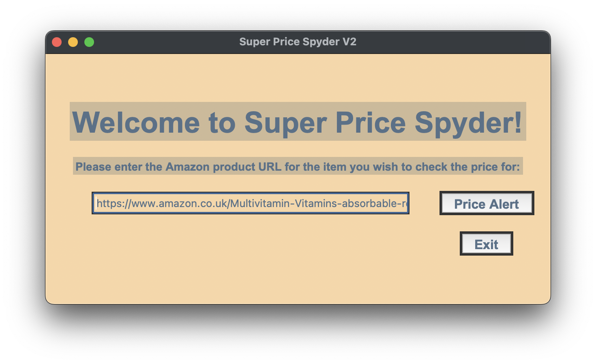

# Super Price Spyder V2 (with GUI)

Welcome to Super Price Spyder V2! This is a python script that creates a Graphical User Interface (GUI) application for users to input the URL of an Amazon product and to receive an automatic email notification if the price changes. The following sections describe how to use the script, the requirements for running it, the components used in building the application and its general functionalities.

## Getting Started

To get started with Super Price Spyder V2, you need to download the script to your local machine and make sure to have the necessary components installed and set up to run the application.

### Prerequisites

The following are the necessary prerequisites for running Super Price Spyder V2:

* [Python 3] (https://www.python.org/downloads/) and all its development packages.
* [Tkinter] (https://tkdocs.com/tutorial/install.html) - a cross-platform graphical user interface package for Python
* An email address with an SMTP server that supports [TLS/SSL]. (https://www.smtp2go.com/ssl-tls)
* An [Amazon product URL].

### Installing

Once the prerequisites are installed and set up, you can install the script by downloading the Super Price Spyder V2 from the downloads location. Unzip the file and save it into your local machine.

### Running the application

To run the application, open the file containing the script in your local machine. Enter the Amazon product URL that you would like to monitor for price changes into the entry field. Next, click the ‘Price Alert’ button to initiate the price alert process. The script will then pull the data, scrape it and extract the item title and price and afterwards utilize the SMTP protocol to send an email with the item information to the user when the price changes to a certain value. When you are done, click the ‘Exit’ button.

## Built With

The following are the components used in building Super Price Spyder V2 with GUI:

* [Python 3]  (https://www.python.org/downloads/)
* [Tkinter] (https://tkdocs.com/tutorial/install.html)
* [SMTP] (https://www.smtp2go.com/ssl-tls)
* [Requests] (https://requests.readthedocs.io/en/master/)
* [Beautiful Soup] (https://pypi.org/project/beautifulsoup4/)

## General Functionalities

Super Price Spyder V2 allows users to enter the URL of an Amazon product and receive an email notification when the price of the product changes to a certain value. Additionally, it provides a graphical user interface with labels and entry fields to enter the Amazon product URL and to initiate the price monitoring process. It utilizes the SMTP protocol to send an email with the item information to the user when the price changes to a certain value.

## Summary

Super Price Spyder V2 is a python script that creates a Graphical User Interface (GUI) application for users to input the URL of an Amazon product and to receive an email notification when the price of the product changes to a certain value. It makes price monitoring of an Amazon product easy and accessible to anyone. 

